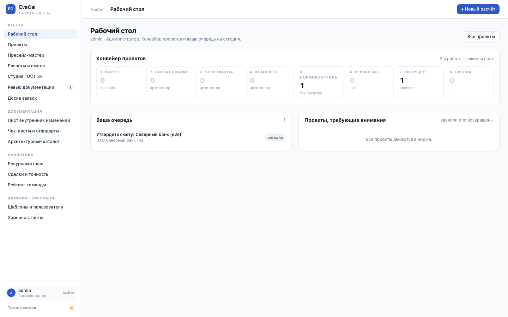
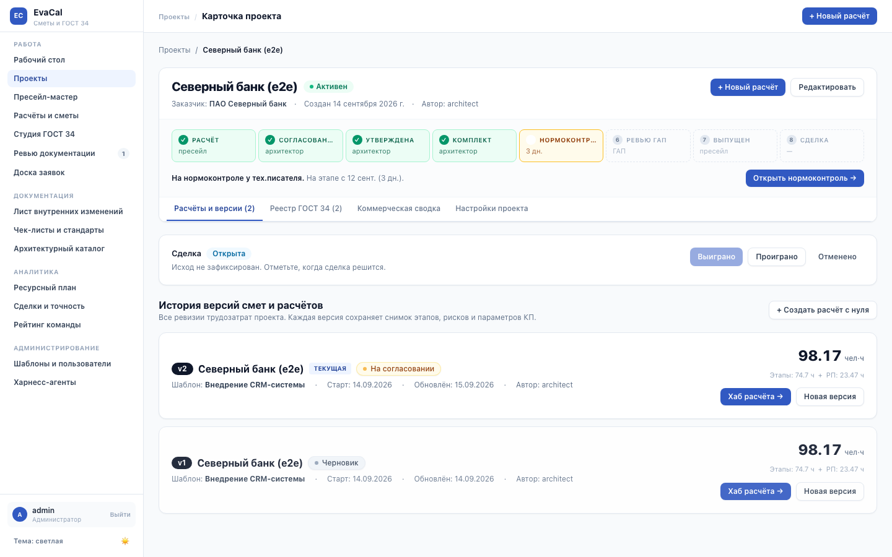
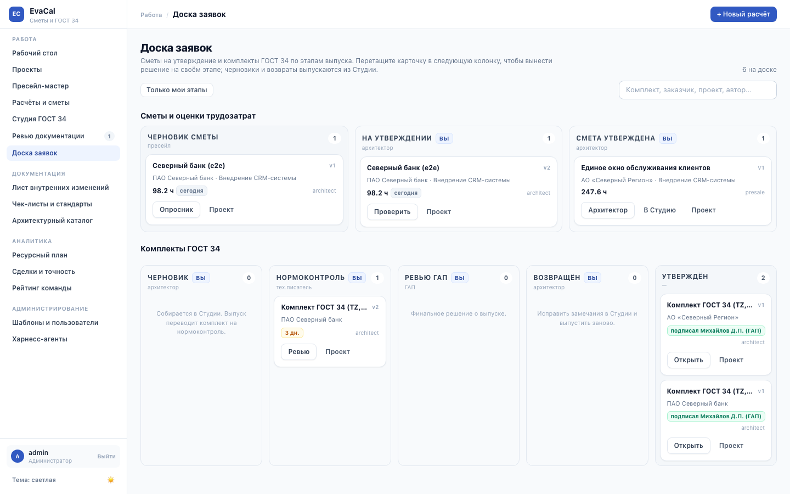

# EvaCal — Корпоративный калькулятор трудозатрат, генератор документации ГОСТ 34 и ИИ-автор ТЗ

**EvaCal** — комплексная корпоративная платформа для пресейла, оценки трудозатрат, автоматизированной генерации комплекта нормативно-технической документации по **ГОСТ 34.602-2020 / РД 50-34.698-90** с оформлением по **ГОСТ 2.104-2006** (Формы 2 и 2а), сквозной матрицей трассируемости и модулем **«LLM как автор ТЗ»**.

---

## 🚀 Ключевые возможности

### 1. 📋 Оценка трудозатрат, Календарный план и Смета КП

- **Шаблоны и формулы**: динамический расчёт человеко-часов по вопросам пресейл-опросника с автоматическим выводом длительности этапов.
- **Матрица ролей и грейдов**: поддержка ролей _Архитектор (в т.ч. ГАП)_, _Инженер / Ведущий инженер_, _Аналитик / Ведущий аналитик_, _Консультант / Ведущий консультант_, _Эксперт по ИБ_, _Разработчик / Ведущий разработчик_, _Руководитель проекта (РП)_.
- **Коммерческое предложение (Смета КП)**: автоматический расчет прямой себестоимости труда по почасовым ставкам, накладных расходов (Overhead), плановой маржинальности, скидок и НДС (20% / без НДС). Защита от деления на ноль при расчёте маржи.
- **Сценарный анализ**: моделирование сценариев _Целевой (Target)_, _Оптимистичный (Best case)_ и _Консервативный (Worst case)_.
- **Диаграмма Ганта**: интерактивная визуализация этапов с учетом рабочих дней, параллельных задач и сроков согласования со стороны Заказчика.
- **Калибровка по похожим проектам**: для расчёта подбираются утверждённые расчёты того же шаблона с близкими ответами опросника (расстояние Гауэра по числовым, порядковым и списочным полям). Панель показывает, насколько у них итог разошёлся с формулой шаблона — медианную поправку, коридор часов, типичный срок и долю рисков — и какие этапы архитектор обычно правит. Сотрудники видят названия соседей и ссылки на них, гости по share-ссылке — обезличенные «Похожий проект №N». API: `GET /api/calculations/:id/calibration`.

---

### 2. 📑 Конструктор-Студия ГОСТ 34 (ГОСТ 34.602-2020 и ГОСТ 34.602-89)

Полноценный 7-шаговый мастер выпуска документов с поддержкой ГОСТ 34.602-2020 / ГОСТ 34.201-2020 и наследуемого профиля РД 50-34.698-90:

```text
[1. Профиль] → [2. Требования] → [3. Применимость] → [4. Трассируемость] → [5. Реквизиты] → [6. Предпросмотр/Правка] → [7. Выпуск (DOCX/ZIP)]
```

#### Комплект формируемых документов:

1. **ТЗ** — _Техническое задание (ГОСТ 34.602-2020)_: 9 обязательных разделов, показатели надежности (SLA 99.9%, RTO ≤ 15 мин, RPO ≤ 5 мин), требования ИБ и матрица трассируемости.
2. **ПЗ** — _Пояснительная записка (ГОСТ 34.201-2020)_: архитектурное обоснование, структура ПО, состав кластеров СУБД и системные требования.
3. **АФ** — _Описание функциональной структуры (ГОСТ 34.201-2020)_: автоматизируемые функции, алгоритмы, роли пользователей и сценарии.
4. **ПМИ** — _Программа и методика испытаний (ГОСТ Р 59792-2021)_: методики проверок, приемочные тесты и ожидаемые результаты по каждому требованию.
5. **СПЕЦИФИКАЦИЯ** — _Ведомость оборудования и ПО (ГОСТ 34.201-2020)_: реестровые номера отечественного ПО (188-ФЗ), спецификации серверных платформ Минпромторга РФ, All-Flash СХД, шкафов 42U и комплектов ЗИП.

#### Оформление по умолчанию (профиль `gost34-modern`):

По результатам нормоконтроля документы выпускаются без чертёжной рамки ЕСКД:

- Номер страницы — сверху по центру, нумерация начинается со второй страницы (титульный лист не нумеруется).
- Разделы первого уровня начинаются с новой страницы; номер без точки, наименование строчными буквами с прописной, шрифт чёрный.
- Таблицы: «Т а б л и ц а N – Наименование» (в приложениях — «А.1»), наименование без полужирного, строка заголовка повторяется на следующих страницах и отделена двойной чертой.
- Единая гарнитура и кегль профиля во всём документе, включая собираемое Word'ом оглавление.
- Буква «ё» не печатается, обозначения стандартов («ГОСТ Р 59793-2021») не разрываются переносом строки.

> **Содержание (оглавление).** Поле TOC намеренно не помечается «требующим обновления»: иначе Word при
> открытии файла показывает запрос об обновлении внешних связей. Поэтому в поле заранее вложен перечень
> разделов, но **без номеров страниц** — разбивку на страницы знает только Word. Чтобы номера появились,
> откройте документ и обновите поле: выделить всё → `F9`, либо правый клик по содержанию → «Обновить поле».

#### Рамки и штампы ГОСТ 2.104-2006 (ГОСТ 2.301) — профиль `gost34-eskd-frame`:

Выбирается явно на шаге «Профиль» мастера или параметром `?layout=gost34-eskd-frame`:

- **Титульный лист и Лист 1**: Форма 2 (основная надпись высотой 40 мм с подписями: _Разработал, Проверил, Т.контр., Н.контр., Утвердил, Утвердил от Заказчика_).
- **Последующие листы (2+)**: Форма 2а (малый штамп высотой 12 мм).
- **ГОСТ-поля**: Левое 20 мм, Правое 10 мм, Верхнее 15 мм, Нижнее 45 мм (исключает наложение текста на подписи и штампы).

---

### 3. 🤖 ИИ-модуль «LLM как автор ТЗ» (ГОСТ 34.602-2020)

Контролируемый слой генерации текста разделов ТЗ с гарантией неизменности детерминированной схемы:

- **Архитектурный принцип**: схема и структура требований остаются единственным источником истины (ground truth). Нейросеть не меняет перечень требований, а генерирует формулировки разделов в строгом соответствии со структурой ГОСТ 34.
- **Поддерживаемые разделы**:
  - **1.1–1.3**: Полное и краткое наименование, шифр, разработчик и заказчик, основание разработки.
  - **2.1–2.3**: Назначение системы, цели создания, критерии достижения целей.
  - **4.1–4.5**: Требования к системе в целом, структуре, режимам функционирования, надежности и безопасности.
- **Strict Prompt v1 & Anti-Hallucination**:
  - Промпты с жёсткими запретами на галлюцинации (запрет выдумывать отсутствующие стандарты, вендоров и метрики).
  - Обязательное цитирование кодов входных требований (`REQ-...`).
  - Валидация схемы ответа модели через JSON Schema.
- **Split-Screen Diff Preview & Пошаговое принятие**:
  - Интерактивное двухоконное сравнение исходного (baseline) текста и черновика (draft).
  - Пошаговое принятие решений архитектором: `Принять черновик` (`ACCEPTED`) или `Откатить` (`REJECTED`).
  - **Экспортный гейт**: в финальный комплект DOCX/ZIP попадают **только** принятые (`ACCEPTED`) разделы. Черновики со статусом `DRAFT` или `REJECTED` не замещают baseline-текст.
- **Безопасный периметр LLM (SSRF Protection)**:
  - Loopback (`http://localhost:11434`, `http://localhost:1234/v1`) разрешён по умолчанию для локальных нейросетей (Ollama, LM Studio).
  - Внутренние корпоративные диапазоны (RFC 1918) блокируются по умолчанию и включаются только при явном флаге `EVACAL_LLM_ALLOW_PRIVATE_NETWORK=true`.
  - Link-local (169.254.0.0/16, fe80::/10) и метаданные облачных провайдеров (AWS, GCP, Azure, OpenStack) **запрещены всегда**.
  - Поддержка внешних OpenAI-совместимых моделей через массив `EVACAL_LLM_PROVIDERS` и защищённые ключи окружения.
- **Тестовый харнесс (Eval Suite)**:
  - 15 автоматических тестов оценки качества черновиков: отсутствие галлюцинаций, цитирование входных требований, структурное соответствие разделам ГОСТ 34.

---

### 4. 📦 Отраслевые пресеты и база знаний вендоров РФ

В систему встроены готовые отраслевые пресеты для быстрого старта с предзаполненными параметрами, нормативными актами и требованиями. Реквизиты продуктов (номера реестров Минцифры/Минпромторга, сертификаты ФСТЭК/ФСБ) централизованы в базе знаний вендоров `lib/gost34/vendors` и сверены с публичными реестрами:

- **UserGate NGFW**: кластеры высокой доступности (HA Active-Passive), сертификат ФСТЭК России № 3905 (4 уровень доверия, МЭ тип А, Б, СОВ), реестр Минцифры № 1194.
- **Серверы и ПАК YADRO / Aquarius / Скала^р**: двухсокетные платформы YADRO Vegman R220 G2, СХД All-Flash NVMe TATLIN.UNIFIED, Реестр Минпромторга (ПП РФ № 878 / № 719).
- **Kaspersky Endpoint Security & KUMA**: расширенная корпоративная защита рабочих станций и серверов (ФСТЭК № 4068), SIEM-мониторинг инцидентов (реестр № 9128), интеграция с ГосСОПКА (приказы ФСБ № 366-368).
- **Cyberpeak**: система аудита доступа к неструктурированным файловым данным, реестр Минцифры № 12590.
- **ViPNet Coordinator HW 4 / Client 4**: ГОСТ-VPN туннелирование, сертификаты ФСБ России № СФ/124-4900 (КС3) и № СФ/124-5189 (КС1/КС2/КС3).
- **Astra Linux SE & Postgres Pro Enterprise**: защищенная ОС (ФСТЭК № 2557, 1 уровень доверия) и СУБД (ФСТЭК № 4063, 4 уровень доверия).
- **Импортозамещение (миграции)**: zVirt (реестр № 4984), ALD Pro, РЕД ОС, миграция БД Oracle/MS SQL → Postgres Pro (Указы Президента РФ № 166 и № 250).
- **Резервное копирование и DR**: Кибер Бэкап (реестр № 4161, ФСТЭК № 4753), RuBackup, правило 3-2-1, неизменяемые копии.
- **Регуляторная база РФ**: 152-ФЗ, 187-ФЗ (КИИ), 188-ФЗ, приказы ФСТЭК № 17, № 21, № 117, № 239, ФСБ № 282, стандарты Банка России (ГОСТ Р 57580.1-2017, 683-П, 719-П).

---

### 4a. 📈 Факт и исход сделки (Horizon E1)

- Исход сделки на карточке проекта: выиграна (версия договора, сумма без НДС), проиграна (причина, конкурент), отменена; переоткрытие с аудитом.
- Факт часов по этапам и РП выигранной версии в редакторе архитектора, закрытие факта (после него правит только админ), CSV-импорт `этап;часы[;начало;окончание]` с предварительной проверкой.
- Метрики: точность по этапам и ролям, фактическая маржа с оверхедом, win rate, «скидка → исход», причины проигрышей; страница `/analytics` для сотрудников.
- Калибровка получает третий слой «формула → утверждено → факт», рейтинг — win rate пресейлов и точность архитекторов.

### 4b. 📅 Ресурсный план по портфелю (Horizon E2)

- Спрос из Гантов всех проектов по ISO-неделям и ролям: часы этапа раскладываются по рабочим дням, согласования и заказчик не считаются. Одна версия на проект: выигранная, иначе последняя утверждённая, иначе на согласовании.
- Веса воронки: выиграна 1.0, утверждена при открытой сделке 0.6, на согласовании 0.3, черновик 0.1 (по запросу). Ёмкость ролей задаёт админ (`/admin/capacity`): ставки × часов в неделю с датой начала действия.
- Тепловая карта `/capacity` (13/26 недель, твёрдый / с воронкой, фильтр ролей, список расчётов в ячейке), what-if со сдвигом расчётов по неделям без записи и применением к датам старта, выгрузка xlsx.
- Предупреждения о перегрузе над Гантом архитектора и виджет «загрузка на 4 недели» на его рабочем столе.

### 4c. ⏱ Контроль сроков и отклонения по задачам (Horizon E3)

- Контроль сроков выигранного проекта: факт дат по этапам, статус этапа (план / в работе / просрочен / завершён), сдвиг окончания, прогноз окончания как план плюс текущий сдвиг, статус проекта на карточке (в графике / риск срыва / опоздание).
- Отклонения по одинаковым задачам: имя этапа нормализуется (регистр, пробелы, номер), по каждой задаче считается медиана факт / план − 1 по всем выигранным проектам; диверджентный график на вкладке аналитики.
- Конструктор срезов `/analytics/deviations`: выбор задач, фильтры по роли, шаблону, архитектору, заказчику и периоду исхода, группировка (задача, роль, шаблон, архитектор, заказчик, месяц, расчёт), метрика (медиана, среднее, P90), сравнение по часам или календарным дням, допуск; срезы сохраняются и выгружаются в xlsx.

### 5. 🔗 Сквозная матрица прослеживаемости требований

5-уровневый интеллектуальный движок сопоставляет каждое проектное требование:

```text
Требование (ТР-ИБ-01) → Раздел ГОСТ 34.602 (п. 4.1.2) → Методика ПМИ (ПМИ-ИБ-01) → Этап проекта → Роль исполнителя
```

- **Выгрузка в Excel (.xlsx)**: отдельный 13-колоночный лист с полной аналитикой покрытия и защитой от CWE-1236 (Formula Injection).
- **Интерактивная вкладка в UI**: наглядная группировка по категориям (Безопасность, ПАК, Поставка ПО, Интеграции, Функции) с возможностью ручной корректировки связей.

---

### 5a. 🧭 Рабочий стол, конвейер проекта и доска заявок

- **Рабочий стол (`/`)** — общий входной экран для всех ролей: конвейер проектов по восьми этапам (Расчёт → Согласование → Утверждена → Комплект → Нормоконтроль → Ревью ГАП → Выпущен → Сделка), личная очередь роли на сегодня и список проектов, которые зависли или возвращены с замечаниями. Конвейер и «требуют внимания» видят роли с доступом к проектам (пресейл, архитектор, ГАП, админ); тех.писатель и рецензент — свою очередь ревью.
- **Жизненный цикл проекта** (`lib/lifecycle.ts`): у каждого проекта один текущий этап, число дней на нём, пороги свежести по этапу (жёлтый / красный), признак внимания (возвращён / завис / на паузе / сделка проиграна) и кнопка следующего действия. Степпер показывается на карточке проекта, колонка «Этап» и фильтр по этапу — в `/projects`, сводка — на рабочем столе.
- **Архив расчётов** переехал с главной на `/calculations` (фильтр по статусу и поиск).
- **Доска заявок (`/board`)** для архитектора, тех.писателя, ГАПа, рецензента и админа: дорожка «Сметы и оценки трудозатрат» (Черновик сметы → На утверждении → Смета утверждена; архитектор перетаскивает смету в «Смета утверждена» = утверждение) и дорожка «Комплекты ГОСТ 34» (Черновик → Нормоконтроль → Ревью ГАП → Возвращён → Утверждён; перетаскивание карточки на своём этапе — это вердикт, диалог подтверждения спрашивает ФИО и комментарий, при возврате комментарий обязателен). Черновики и возвращённые комплекты выпускаются из Студии и не перетаскиваются.
- **Фильтры в URL**: на всех списковых экранах чипы и поиск (с задержкой ввода) применяются сразу и хранятся в адресной строке — ссылку на отфильтрованный список можно передать коллеге.


_Рабочий стол: конвейер проектов, очередь роли и проекты, требующие внимания._


_Карточка проекта: степпер этапов, дни на этапе и кнопка следующего действия._


_Доска заявок: дорожки смет и комплектов ГОСТ 34, перетаскивание карточки = вердикт на своём этапе._

---

### 6. 🎨 Темы оформления интерфейса

Две темы, выбор запоминается в браузере (переключатель внизу сайдбара):

- **Светлая (по умолчанию)**: максимальная чёткость и контрастность для работы с большими объёмами текста нормативных документов.
- **Тёмная (Nord)**: холодная северная палитра для комфортной работы в условиях низкой освещённости.

---

### 7. 🛡 Безопасность и управление доступом

- **Ролевая модель**: 6 изолированных ролей с разграничением интерфейсов и прав:
  - `presale` (Опросники, предварительная оценка трудозатрат, коммерческие предложения)
  - `architect` (Календарный план, Гант, Конструктор-Студия ГОСТ 34, ИИ-черновики, выпуск комплектов)
  - `techwriter` (Нормоконтроль комплекта: чек-лист, замечания по разделам, вычитанная версия DOCX)
  - `gap` (Главный архитектор проекта: финальное ревью и подпись выпуска)
  - `reviewer` (Рецензирование расчётов и комплектов: читает и ведёт замечания, вердикта не выносит)
  - `admin` (Управление пользователями, системные настройки, пресеты; надмножество всех ролей — видит все разделы, включая пресейл-мастер и чек-листы, и обе очереди ревью на `/review`)
- **Разделение подписей**: обе подписи под комплектом принадлежат разным ролям и проверяются сервером. Нормоконтроль подписывает `techwriter`, выпуск утверждает `gap`; архитектор, выпустивший комплект, своей подписи под ним не ставит. Попытка решить за чужой этап отклоняется с 403 независимо от того, что показывает интерфейс.
- **Защищённые сессии**: криптографическая подпись HMAC-SHA256, флаги `HttpOnly`, `SameSite=Lax`, `Secure` (в production или при TLS; production-сборка на plain `http://localhost` флаг `Secure` не ставит — иначе Safari теряет сессию; `FORCE_SECURE_COOKIES=true` возвращает строгий режим).
- **Серверный отзыв сессий**: in-memory хранилище отозванных сессий с автоматической очисткой по TTL.
- **Share-токены**: безопасные ссылки для внешнего просмотра расчётов с ограничением области действия и проверкой подписи.

---

## 🛠 Технологический стек

- **Frontend & Backend**: Next.js 15 (App Router, Server Components & Route Handlers), React 18, TypeScript.
- **Styling**: Tailwind CSS (светлая и тёмная Nord темы).
- **ORM & Database**: Prisma 7. Основная СУБД — PostgreSQL 14+ (версионированные миграции в `prisma/postgresql/migrations`; тесты и сборка в CI идут против неё); для одного стенда без отдельной СУБД — встраиваемый SQLite (`DATABASE_PROVIDER=sqlite`).
- **Генерация документов**: `docx`, `mammoth`, `jszip`, `pdfkit`, `xlsx` (SheetJS).
- **Хранилище артефактов**: файловое (том `storage-data`) или S3-совместимое через `@aws-sdk/client-s3` (AWS S3, MinIO, Yandex/VK Object Storage).
- **Аналитика**: чистые модули без ORM (`lib/actuals.ts`, `lib/capacity.ts`, `lib/schedule.ts`, `lib/deviations.ts`), графики на inline-SVG без внешних библиотек.
- **Тестирование**: Vitest (**76 test suites, 645 tests**, Golden Tests ГОСТ 34, Eval Suite LLM, JUnit XML reporter).
- **CI/CD & Инфраструктура**: Docker multi-stage (Node 22 Alpine, non-root user 1001, automated schema sync & seed), Docker Compose, Nginx (TLS, HSTS, Gzip, Security Headers), Jenkins Pipeline (`Jenkinsfile`) & GitHub Actions.

---

## ⚡️ Быстрый старт (Локальная разработка)

```bash
# 1. Клонирование и установка зависимостей
git clone https://github.com/onixus/EvaCal.git
cd EvaCal
npm install

# 2. Настройка окружения
cp .env.example .env
# Сгенерируйте SESSION_SECRET при необходимости:
# node -e "console.log(require('crypto').randomBytes(32).toString('hex'))"

# 3. База данных: PostgreSQL (например, docker run -d -p 5432:5432 -e POSTGRES_USER=evacal \
#    -e POSTGRES_PASSWORD=secret -e POSTGRES_DB=evacal postgres:16-alpine), затем
#    генерация клиента, миграции и сидирование
npx prisma generate
npm run db:sync
npm run db:seed
# Без PostgreSQL: DATABASE_PROVIDER=sqlite и DATABASE_URL="file:./prisma/dev.db" в .env,
# те же три команды (db:sync под SQLite делает prisma db push)

# 4. Запуск dev-сервера
npm run dev
```

Приложение доступно по адресу: **`http://localhost:3000`**.

### Учётные данные и пароли

При первом запуске команды `npm run db:seed` создаются 4 стандартные учётные записи:

- **`admin`** (Администратор)
- **`architect`** (Архитектор)
- **`presale`** (Пресейл)
- **`reviewer`** (Ревьювер)

> [!IMPORTANT]
> Сид генерирует криптографически стойкие одноразовые пароли, выводит их в терминал и записывает в файл **`credentials.local.txt`** (добавлен в `.gitignore`).
>
> **Сброс паролей на локальном dev-стенде**:
>
> ```bash
> npx tsx reset-all.ts admin            # один пользователь
> npx tsx reset-all.ts --all            # все
> ```
>
> Каждому пользователю выдаётся новый случайный пароль, ставится флаг обязательной смены, пароли печатаются один раз в терминал. Общего «тестового» пароля нет.

---

## 🐳 Запуск через Docker Compose

Развёртывание через Docker автоматизировано: контейнер миграции `migrate` выполняет синхронизацию схемы БД и сидирование до старта веб-приложения `app`.

### Шаг 1. Подготовка конфигурации окружения

```bash
cp .env.example .env
```

Отредактируйте `.env`:

0. Задайте `POSTGRES_PASSWORD` для встроенного PostgreSQL (или `DATABASE_URL` внешнего сервера).
1. Укажите случайный `SESSION_SECRET`:
   ```bash
   node -e "console.log(require('crypto').randomBytes(32).toString('hex'))"
   ```
2. _(Опционально)_ Если вы хотите задать фиксированный пароль для всех ролей в Docker, раскомментируйте:
   ```env
   SEED_DEFAULT_PASSWORD="YourStrongPassword123!"
   ```
   Если переменная не задана, генератор создаст безопасные случайные пароли.

### Шаг 2. Запуск контейнеров

```bash
docker compose up -d --build
```

- Контейнер `migrate` запустится первым, синхронизирует схему (`scripts/db-sync.ts`: `prisma db push` для SQLite, `prisma migrate deploy` для PostgreSQL), сгенерирует Prisma Client, наполнит базу данных отраслевыми пресетами и создаст учётные записи пользователей.
- После успешного завершения миграции автоматически запустится основной контейнер `app`.
- Веб-интерфейс будет доступен по адресу:
  - **`http://localhost:3000`** (напрямую к приложению)
  - **`http://localhost`** / **`https://localhost`** (через Nginx reverse proxy)

### База данных: PostgreSQL или SQLite

По умолчанию приложение работает на PostgreSQL: `docker compose up` поднимает сервис `postgres` (том `pg-data`), контейнер `migrate` применяет миграции `prisma/postgresql/migrations` (`prisma migrate deploy`), CI-пайплайн гоняет тесты, сборку и e2e против такого же сервера. Внешний сервер: укажите его адрес в `DATABASE_URL` в `.env`, встроенный тогда простаивает.

Модель данных одна (`prisma/schema.prisma`); копия схемы под PostgreSQL в `prisma/postgresql/schema.prisma` порождается из неё командой `npm run db:schema:sync` и проверяется тестом. Провайдер выводится из схемы `DATABASE_URL` (`postgresql://` или `file:`). Prisma Client компилирует SQL под диалект конкретной СУБД, поэтому там, где клиент генерируется раньше, чем известен URL (сборка Docker-образа, CI), провайдер задаётся явно через `DATABASE_PROVIDER`.

SQLite остаётся для одного стенда без отдельной СУБД. В `.env`:

```env
DATABASE_PROVIDER=sqlite
DATABASE_URL="file:./prisma/dev.db"
```

и пересборка образа, так как провайдер фиксируется на сборке: `docker compose up -d --build`. База живёт в томе `db-data`, схема синхронизируется через `prisma db push`.

Новая миграция после правки `prisma/schema.prisma` (нужен доступ к PostgreSQL):

```bash
npm run db:schema:sync
npm run db:migrate:pg -- --name <что_изменилось>
```

Перенос данных между SQLite и PostgreSQL штатной командой не делается: выгрузите таблицы любым инструментом (например, `sqlite3 .dump` → правка типов → `psql`) или начните с чистой базы и сида.

### Хранилище артефактов: файлы или S3

ZIP выпущенных комплектов и DOCX тех.писателя лежат вне базы (`lib/gost34/storage.ts`). Два бэкенда за одним интерфейсом, в базе хранится одинаковый относительный ключ `<проект>/<пакет>.zip`, поэтому переключение не требует миграции строк, только переноса файлов.

- **Файлы (по умолчанию)** — `GOST_PACKAGE_STORAGE_PATH` (`storage/gost-packages`), в Docker том `storage-data`. Подходит одному экземпляру приложения.
- **S3-совместимое хранилище** — AWS S3, MinIO, Yandex/VK Object Storage, Ceph RGW. Единственный вариант для нескольких реплик и централизованных бэкапов. Включается заданным `S3_BUCKET` (или явно `GOST_PACKAGE_STORAGE=s3`); параметры в `.env.example`. При своём `S3_ENDPOINT` по умолчанию path-style адресация. Бакет создаётся заранее.

Встроенный MinIO для стенда:

```bash
# .env: S3_BUCKET=evacal-artifacts, S3_ENDPOINT=http://minio:9000,
#       S3_ACCESS_KEY_ID=evacal, S3_SECRET_ACCESS_KEY=<пароль>
docker compose --profile minio up -d
# затем создать бакет в консоли http://127.0.0.1:9001 (логин — S3_ACCESS_KEY_ID / S3_SECRET_ACCESS_KEY)
```

Целостность: SHA-256 считается при записи, отправляется в S3 как контрольная сумма объекта и пересчитывается при чтении; ответ API отдаёт его в `X-Checksum-SHA256`.

### Шаг 3. Как получить пароли после запуска в Docker

В Docker пароли выдаются и сохраняются несколькими способами:

#### Способ 1. Просмотр логов миграции (Рекомендуемый)

```bash
docker compose logs migrate
```

В логах отобразится приветственный баннер со сформированной таблицей логинов и сгенерированных паролей:

```text
======================================================================
EvaCal — учётные записи по умолчанию (созданы при первом запуске)
Эти пароли показываются только один раз. Смените их после первого входа в /account.

  роль: presale    логин: presale      пароль: <пароль>
  роль: architect  логин: architect    пароль: <пароль>
  роль: reviewer   логин: reviewer     пароль: <пароль>
  роль: admin      логин: admin        пароль: <пароль>
======================================================================
```

Лог живёт столько же, сколько контейнер `migrate` (`docker compose down` его удаляет). В том `db-data` пароли не сохраняются.

#### Способ 2. Сброс паролей в Docker-стенде

Если лог утерян, выдайте новые случайные пароли:

```bash
docker compose run --rm migrate npx tsx reset-all.ts --all
# или одному пользователю:
docker compose run --rm migrate npx tsx reset-all.ts admin
```

Пароли печатаются в вывод команды один раз. После входа система требует сменить пароль: пока он не сменён, остальные страницы и API недоступны.

### Управление Docker-окружением

```bash
# Просмотр статуса сервисов
docker compose ps

# Просмотр логов приложения
docker compose logs -f app

# Остановка контейнеров
docker compose down

# Полный сброс базы данных и повторный запуск с нуля
docker compose down -v
docker compose up -d --build
```

---

## 🧪 Тестирование и проверка качества

```bash
# Проверка типов TypeScript (без эмиссии артефактов)
npm run typecheck

# Строгий линтинг (ESLint, 0 warnings)
npm run lint

# Запуск полного набора юнит, интеграционных и eval-тестов (76 сьютов, 645 тестов)
npm test

# Запуск тестов для CI с генерацией отчёта JUnit XML (test-results.xml)
npm run test:ci

# Обновление эталонных golden-документов ГОСТ 34
npm run test:golden:update

# Полная production-сборка
npm run build
```

---

## 🔄 CI/CD Пайплайн

В репозитории настроены готовые конфигурации для автоматизации сборки и тестирования:

- **Jenkins (`Jenkinsfile`)**:
  1. `Install Dependencies`: `npm ci`, генерация Prisma Client.
  2. `Security Audit`: проверка уязвимостей зависимостей.
  3. `Lint & Typecheck`: `npm run lint` и `npm run typecheck`.
  4. `Test`: запуск тестов с публикацией отчёта JUnit XML (`test-results.xml`).
  5. `Build`: компиляция production-сборки Next.js.
- **GitHub Actions (`.github/workflows/docker-build.yml`)**:
  - Автоматическая мультиплатформенная сборка Docker-образа и публикация в GitHub Packages Container Registry (GHCR).

---

## 📚 Документация

| Документ                                                                           | Описание                                                                                                                       |
| :--------------------------------------------------------------------------------- | :----------------------------------------------------------------------------------------------------------------------------- |
| [docs/ROLES_ONBOARDING.md](docs/ROLES_ONBOARDING.md)                               | **Маршрутный лист новичка:** детальный сценарий работы для всех 6 ролей (presale, architect, techwriter, gap, reviewer, admin) |
| [docs/LLM_TZ_AUTHOR_DESIGN.md](docs/LLM_TZ_AUTHOR_DESIGN.md)                       | **Архитектура «LLM как автор ТЗ»:** baseline-схема, генерация черновиков, diff preview, SSRF security perimeter                |
| [docs/RELEASE_REGISTRY_PLAN.md](docs/RELEASE_REGISTRY_PLAN.md)                     | Проект, реестр снимков мастера, неизменяемые ZIP-архивы и сквозное согласование                                                |
| [docs/CRITICAL_ASSESSMENT_AND_ROADMAP.md](docs/CRITICAL_ASSESSMENT_AND_ROADMAP.md) | Критическая оценка продукта, архитектурные горизонты A–E и дорожная карта развития                                             |
| [docs/BUSINESS_FEATURES_DESIGN.md](docs/BUSINESS_FEATURES_DESIGN.md)               | **Horizon E:** факт и исход сделки, ресурсный план по портфелю, контроль сроков и конструктор срезов по отклонениям            |
| [docs/GOST34_MODERNIZATION_PLAN.md](docs/GOST34_MODERNIZATION_PLAN.md)             | План модернизации модуля ГОСТ 34 (структура разделов, нормативная база, профили)                                               |
| [docs/SECURITY_PERIMETER.md](docs/SECURITY_PERIMETER.md)                           | Периметр безопасности: модель доступа ACL, серверная аннуляция сессий, share-токены, аудит                                     |
| [docs/BackLog.MD](docs/BackLog.MD)                                                 | Статус вех разработки, закрытые задачи и бэклог функциональности                                                               |
